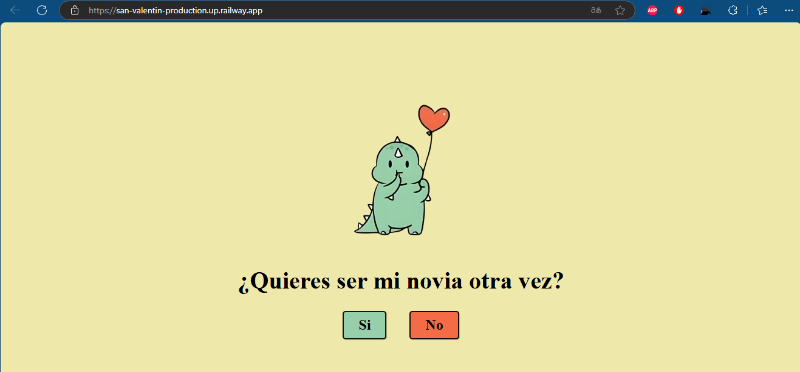

# Valentine's Day - Interactive Love Letter

This project is an interactive HTML love letter for Valentine's Day, designed to express affection in a unique and fun way. It includes a personalized message and the special question: **"Will you be my girlfriend again?"** Accompanied by adorable dinosaur images, the page lets the recipient interact with buttons to answer "Yes" or "No".

## Structure

- **HTML**: The main structure of the page, featuring a simple design that highlights the most important elements—a heartfelt message and the special question.
- **CSS**: The `style.css` file handles the visual presentation, including the layout of the images and the appearance of the buttons.
- **JavaScript**: A `script.js` script manages the interaction with the "Yes" and "No" buttons.

## Features

- **Personalized Message**: A header with the text _"I always knew you'd say yes"_ followed by the main question.
- **Thematic Images**: Two adorable dinosaur images that emphasize the love theme.
- **Interactivity**: Buttons that allow the recipient to respond to the question.

Enjoy expressing your love in an interactive way!
## Railway Deployment

The Valentine's Day Interactive Love Letter is deployed on Railway, allowing you to experience the application live. This deployment showcases the interactive design, heartfelt message, and fun interactivity.

### Live Application Link:

[Visit the live project on Railway](https://san-valentin-production.up.railway.app/)

> **Note**  
> Visit the link to:  
> - Explore the interactive Valentine's Day love letter.  
> - See the personalized message and thematic design.  
> - Interact with the "Yes" and "No" buttons for a unique experience.  

## Railway Results

  

